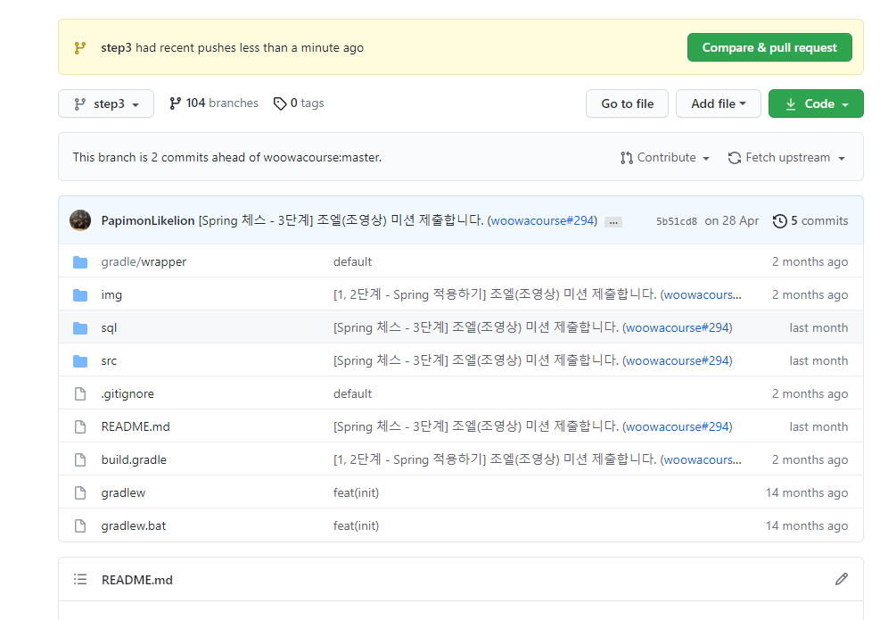
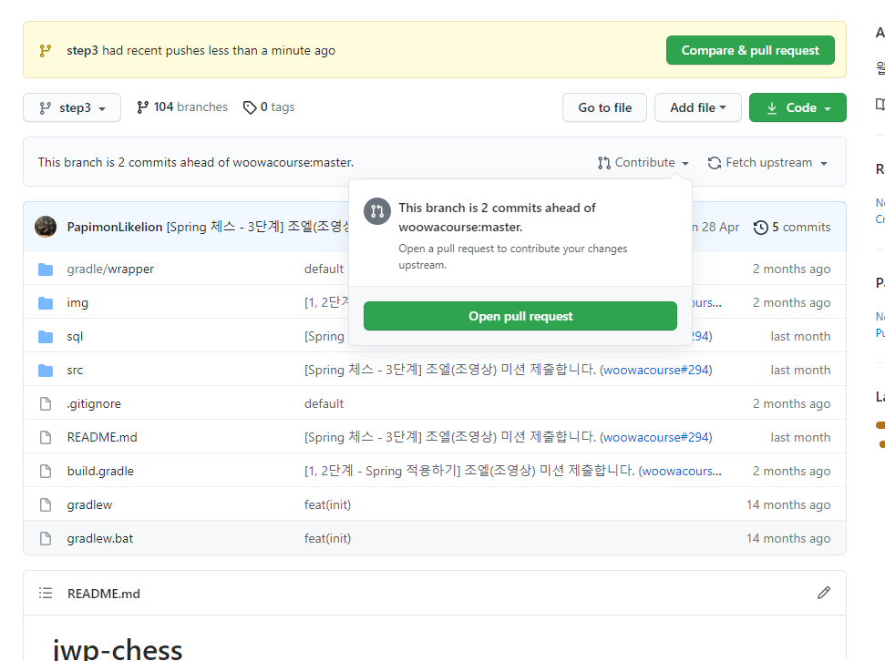
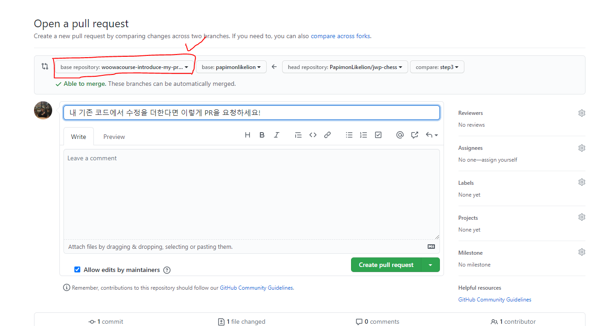
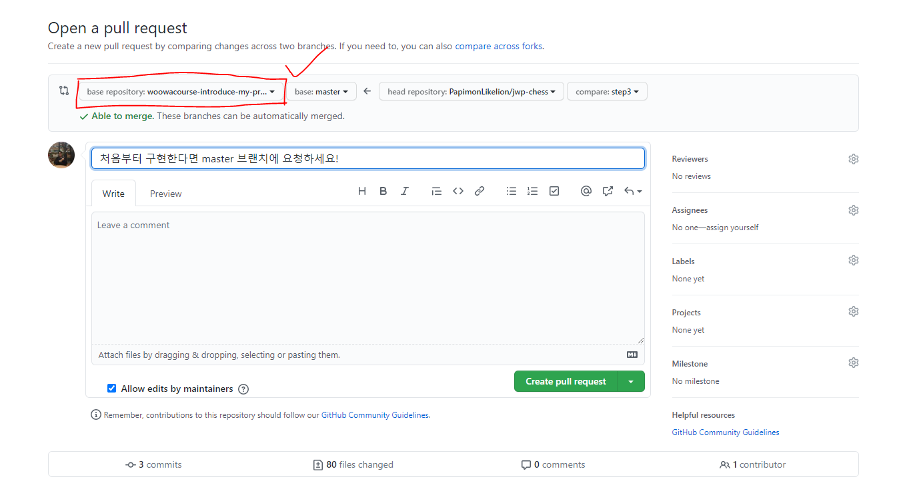
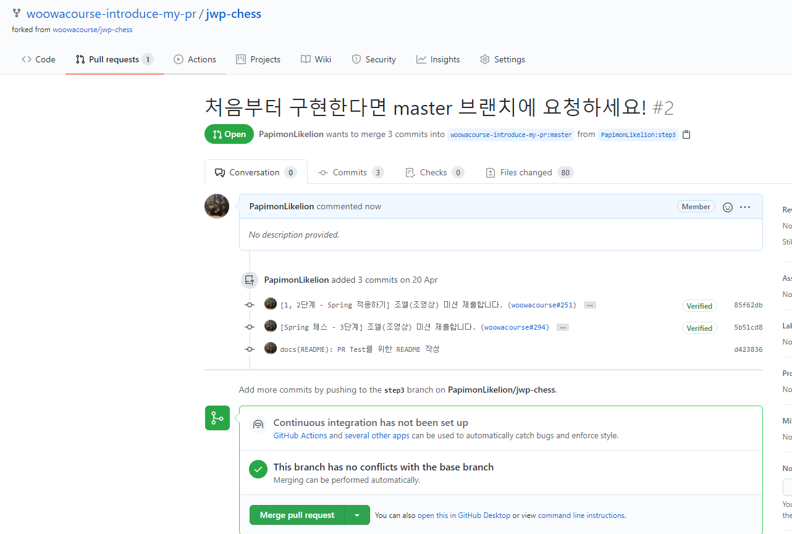

## 나의 PR을 소개합니다 🎁

### 🛳 참여자
- 조엘, 우기, 포모, 완태

### 📜 스터디 진행 방법
1.	각 스터디 원은 각 미션에서 자신이 어떤 부분을 중점으로 개발했는지를 다시 살펴본다. (복습)

2.	자신이 미션을 진행하면서 고민했던 부분, 느꼈던 감정, 페어 프로그래밍에서 힘들었던 점 등을 얘기할 수 있도록 준비해 온다. (회고)

3.	리뷰어에게 어떤 피드백을 받았는지, 어떻게 코드가 개선되었는지를 다른 크루가 “알아듣기 쉽게” 설명할 수 있도록 준비해 온다. (지식 공유)

4.	레벨 2가 끝난 지금, 이전 미션의 구현 방식에서 더 개선될 포인트가 보인다면 얘기할 수 있도록 준비해 온다. (성장 포인트)

5.	만약 미션을 다시 구현하고 싶다면, 새로 PR을 보내 구구에게 피드백 요청을 받는다. (이건 Optional)

### ⏰ 스터디 시간
- 총 2일에 걸쳐서 스터디 운영할 예정!
    - Day 1: 스프링 입문 – 체스 & 스프링 – 지하철 노선도 관리 **(6월 12일 오후 8시)**
    - Day 2: 스프링 – 경로 조회 / 로그인 & 스프링 – 협업 미션 **(날짜 미정)**

### 🎉 PR 보내는 방법
1. 자신이 기존에 미션을 진행했던 Repository에서 step3 브랜치를 만든 후, 구현하고 싶은 사항을 구현한다. 
    

2. 자신이 기존에 미션을 진행했던 Repository에서 Contribute 버튼을 클릭 한 후, Open Pull Request를 클릭한다.
    

3. step3 브랜치에서 step2까지 구현했던 코드에 추가적으로 내용을 구현한 경우, woowacourse-introduce-my-pr의 자신 ID 브랜치에 PR을 보낸다. 
    

4. step3 브랜치에서 처음부터 내용을 구현한 경우, woowacourse-introduce-my-pr의 master 브랜치에 PR을 보낸다.
    

5. 다음과 같이 성공적으로 PR을 생성한 후, 리뷰를 요청한다!
    
